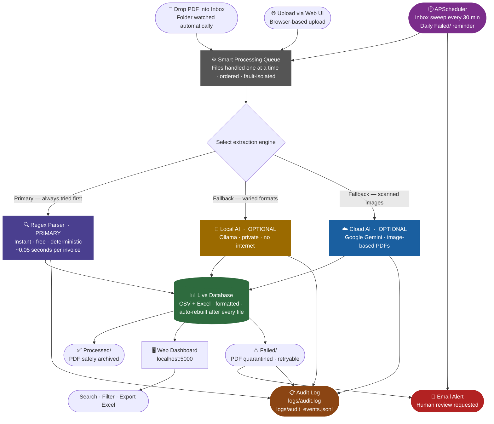

# Invoice RPA Extraction System

An end-to-end **Robotic Process Automation (RPA)** pipeline that automatically monitors a folder for PDF invoices, extracts structured data using a deterministic rule-based parser, and outputs a live-updating Excel database with a web dashboard.

**Production-grade additions:** autonomous scheduler, immutable audit trail, and human-review email alerts for failed documents.

---

## System Architecture



---

## Features

- **Zero-cost local processing** — rule-based regex parser, no API keys or cloud services needed
- **Live folder watching** — drop a PDF into `Inbox/` and it's processed automatically within seconds
- **Autonomous scheduler** — APScheduler re-scans Inbox every 30 min and sends daily Failed/ reminders
- **Immutable audit trail** — every action, decision, and exception is timestamped in `logs/audit.log` + `logs/audit_events.jsonl`
- **Human-review alerts** — any file that lands in `Failed/` triggers an HTML email to the configured reviewer
- **Web dashboard** — browse, search, and export extracted data at `http://localhost:5000`
- **Dual output** — structured `CSV` + formatted `Excel (.xlsx)` updated after every file
- **Fallback engines** — optional Ollama (local LLM) or Google Gemini (cloud) for non-standard formats
- **Fault tolerant** — failed files are moved to `Failed/`, successfully processed files to `Processed/`

---

## Project Structure

```
invoice-rpa/
├── app.py              # Flask web server + REST API
├── rpa_bot.py          # Core RPA engine (parser, watchdog, queue, DB writer)
├── audit_log.py        # Structured audit logger (rotating .log + .jsonl)
├── notifier.py         # SMTP email notifier for human-review alerts
├── scheduler.py        # APScheduler — inbox sweep + daily Failed/ reminder
├── integration_test.py # Full system integration test
├── config.json         # Runtime configuration (engine, schedule, notifications)
├── index.html          # Web UI frontend
├── requirements.txt    # Python dependencies
│
├── Inbox/              # Drop PDFs here → auto-processed  (auto-created)
├── Processed/          # Successfully extracted PDFs       (auto-created)
├── Failed/             # PDFs that failed extraction       (auto-created)
│
├── logs/
│   ├── audit.log             # Human-readable rotating audit log
│   └── audit_events.jsonl    # Machine-readable JSONL event stream
│
├── Extracted_Database.csv    # Master data store
└── Extracted_Database.xlsx   # Formatted Excel output (auto-rebuilt)
```

---

## Quick Start

### 1. Install dependencies

```bash
pip install -r requirements.txt
```

### 2. Start the web server

```bash
python app.py
```

Open **http://localhost:5000** in your browser.

### 3. Process invoices

**Option A — Live (watchdog):** Drop any PDF into the `Inbox/` folder while the server is running.

**Option B — Web upload:** Use the "Upload & Process" panel in the browser UI.

**Option C — Scheduled:** The APScheduler automatically re-scans `Inbox/` every 30 minutes without any manual trigger.

### 4. Run integration tests

```bash
python integration_test.py
```

---

## Configuration (`config.json`)

```json
{
  "engine": "regex",
  "api_key": "",
  "ollama_model": "qwen2.5:7b",
  "inter_file_delay": 2,
  "schedule": {
    "inbox_scan_interval_minutes": 30,
    "reminder_hour": 8,
    "reminder_minute": 0,
    "timezone": "UTC"
  },
  "notifications": {
    "enabled": true,
    "smtp_host": "smtp.gmail.com",
    "smtp_port": 587,
    "smtp_user": "you@gmail.com",
    "smtp_password": "your-gmail-app-password",
    "from_address": "you@gmail.com",
    "to_addresses": ["reviewer@yourcompany.com"],
    "subject_prefix": "[RPA ALERT]"
  }
}
```

| Engine | Description | Cost |
|--------|-------------|------|
| `regex` | Deterministic rule-based parser — **default, fastest, most accurate** for SuperStore format | Free |
| `ollama` | Local LLM via [Ollama](https://ollama.com) — use for varied/unknown invoice formats | Free |
| `gemini` | Google Gemini API — use for scanned/image PDFs that have no text layer | Paid |

> **Gmail users:** Generate an **App Password** (not your login password) at  
> My Account → Security → 2-Step Verification → App Passwords

---

## Scheduler Jobs

| Job | Trigger | Default | Purpose |
|-----|---------|---------|---------|
| Inbox sweep | Interval | Every 30 min | Re-queues any PDFs in `Inbox/` |
| Failed reminder | Cron | Daily 08:00 UTC | Emails reviewer if `Failed/` has files |

Check scheduler status: `GET /api/scheduler-status`

---

## Audit Log

Every event is recorded to two files:

| File | Format | Use |
|------|--------|-----|
| `logs/audit.log` | Human-readable text | Ops / compliance reading |
| `logs/audit_events.jsonl` | JSON per line | Machine querying / SIEM |

**Logged events:** `SERVER_START`, `CONFIG_LOADED`, `FILE_QUEUED`, `FILE_PROCESSING_START`, `EXTRACTION_OK`, `EXTRACTION_FAIL`, `FILE_SKIPPED`, `SCHEDULER_STARTED`, `SCHEDULER_INBOX_SCAN`, `SCHEDULER_FAILED_REMINDER`, `HUMAN_REVIEW_REQUIRED`, `EMAIL_SENT`, `EMAIL_SKIPPED`

API endpoints:
- `GET /api/audit-log?n=200` — last N events as JSON
- `GET /api/audit-log/download` — download raw `audit.log`

---

## Human-Review Email Alert

When any file lands in `Failed/`, the bot:
1. Logs a `HUMAN_REVIEW_REQUIRED` audit event (always happens)
2. Sends an **HTML email** to the configured reviewer address

The email includes: filename, failure reason, timestamp, and instructions to retry.

Update SMTP settings at runtime (no restart needed):
```bash
curl -X POST http://localhost:5000/api/settings/notifications \
  -H "Content-Type: application/json" \
  -d '{"enabled": true, "smtp_password": "your-new-password"}'
```

---

## REST API Reference

| Method | Endpoint | Description |
|--------|----------|-------------|
| GET | `/` | Web UI |
| GET | `/api/data` | All extracted records |
| GET | `/api/status` | Queue depth, current file, engine |
| POST | `/api/upload` | Upload a PDF for processing |
| POST | `/api/clear` | Reset all data |
| GET | `/api/download/csv` | Download CSV |
| GET | `/api/download/xlsx` | Download Excel |
| POST | `/api/settings` | Update engine / API key |
| POST | `/api/settings/notifications` | Update email settings |
| GET | `/api/audit-log` | Last N audit events (JSON) |
| GET | `/api/audit-log/download` | Download audit.log |
| GET | `/api/scheduler-status` | Scheduler jobs + next run times |

---

## Extracted Fields

| Column | Description |
|--------|-------------|
| Invoice # | Invoice reference number |
| Order ID | Associated order identifier |
| Date | Invoice issue date |
| Vendor | Issuing company name |
| Client | Billed-to name |
| Ship To Address | Delivery address |
| Ship Mode | Shipping method |
| Subtotal | Pre-discount total |
| Discount | Discount amount |
| Shipping | Shipping cost |
| Tax | Tax amount |
| Total | Final payable amount |
| Balance Due | Outstanding balance |
| Item Description | Product name(s) — pipe-separated for multi-item invoices |
| SKU / Category | Product category and SKU code |
| Qty | Quantity ordered |
| Unit Price | Per-unit rate |
| Line Amount | Line total |

---

## Performance

Tested on a dataset of **990 SuperStore PDF invoices**:

| Metric | Result |
|--------|--------|
| Total files processed | 990 |
| Processing failures | 0 |
| Average time per file | ~0.05 seconds |
| Total processing time | ~50 seconds |
| Output rows | 989 |

---

## Requirements

- Python 3.9+
- See `requirements.txt` for all packages

### Optional (for LLM engine)
- [Ollama](https://ollama.com) installed and running (`ollama serve`)
- Recommended model: `ollama pull qwen2.5:7b`

---

*Built as a production-grade demonstration of RPA principles: automated document intake, structured data extraction, autonomous scheduling, immutable audit trails, fault-tolerant processing, and human-in-the-loop review escalation.*
